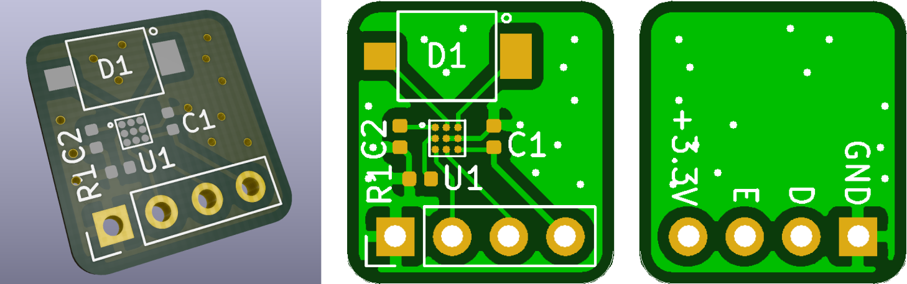
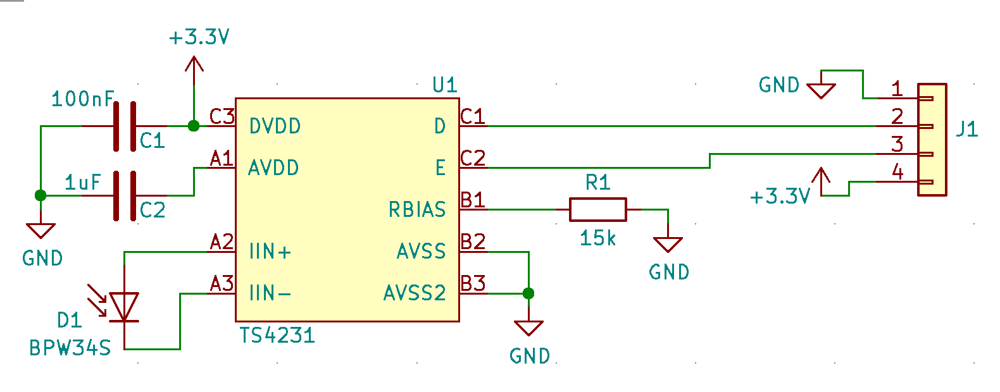
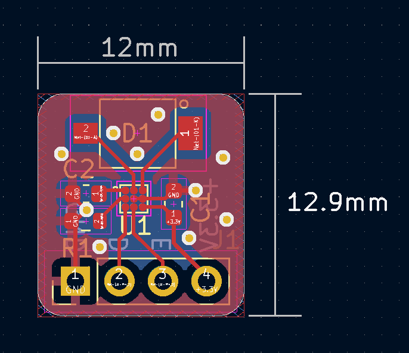
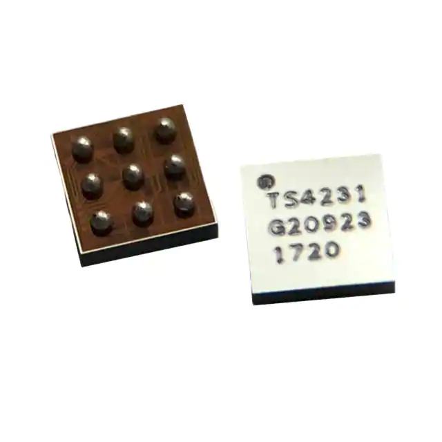
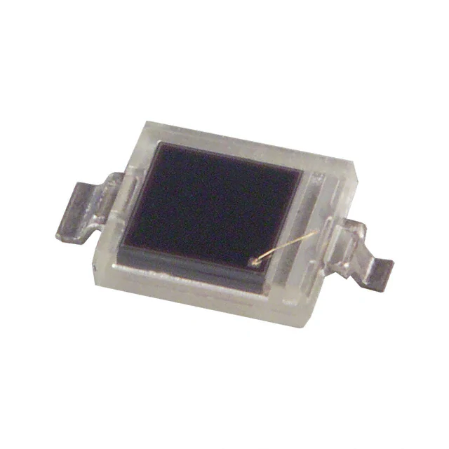
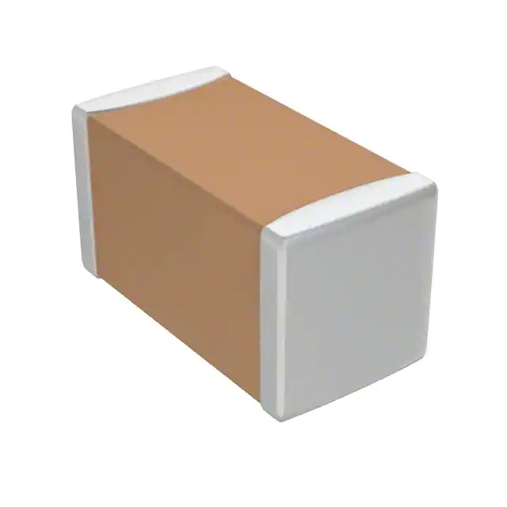
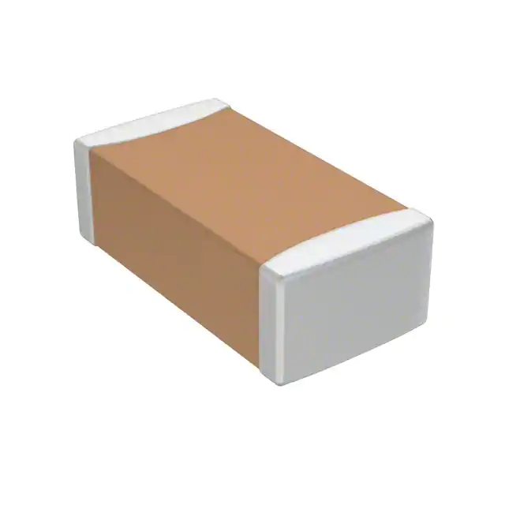
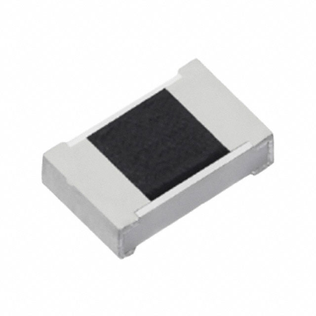

# TS4231-breakout-board
Kicad hardware files for a breakout board of the TS4231 lighthouse v2 receiver IC from Triad Semiconductors. 
The PCB was designed to be as small as possible, and expose the 2 data lines from the TS4231 as well as VCC and GND

    

## Schematic

The schematic was taken directly from the recommended circuit from the TS4231 datasheet.

    

## PCB

    

## Bill of Materials
| Image | Function | Name | Quantity | Price per unit | Link |
|---|---|---|---|---|---|
|      | Lighthouse Receiver IC | TS4231 | 1 | $2.37 | [Buy](https://www.digikey.com/short/7jnj8fr2) |
|  | Photodiode 850nm 20ns 120° 2-SMD, Gull Wing | BPW 34 S-Z | 1 | $1.33 | [Buy](https://www.digikey.com/short/jhrrf52v) |
|     | 1 µF ±10% 16V Ceramic Capacitor X7R 0603 (1608 Metric) | CL10B105KO8NNNC | 1 | $0.1 | [Buy](https://www.digikey.com/short/j7tzj5fq) |
|   | 0.1 µF ±10% 16V Ceramic Capacitor X7R 0603 (1608 Metric) | CC0603KRX7R7BB104 | 1 | $0.1 | [Buy](https://www.digikey.com/short/vj2zz4q8) |
|    | 	
15 kOhms ±1% 0.1W, 1/10W Chip Resistor 0603 (1608 Metric) | ERJ-3EKF1502V | 1 | $0.1 | [Buy](https://www.digikey.com/short/5w9hm2pj) |

Total cost of components per unit: $4.0

## References
- TS4231 Datasheet: [Link](https://www.digikey.com/en/htmldatasheets/production/5835669/0/0/1/ts4231)
- Similar PCB project: [Link](https://hackaday.io/project/19570-htc-vive-lighthouse-custom-tracking/log/146239-ts4231)